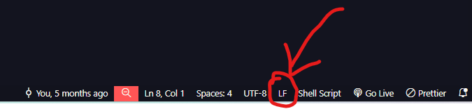

# STHEGA

Aplicativo WEB (API/Frontend) desenvolvido como projeto de TCC sobre dimensionamento de Trocadores de Calor Casco e Tubo com o uso de Algoritmos Genéticos.

## Instalação e Uso

1. Copiar ou clonar o repositório localmente
2. Abrir o repositório no VsCode ou outra IDE
3. Instalar [Docker](https://www.docker.com/products/docker-desktop/).
4. Para garantir que o Docker esteja iniciado, abra o aplicativo do Docker Desktop
5. Abrir um terminal no VsCode e executar o comando abaixo:

```
docker compose up
```

6. Caso ocorra um erro nessa etapa, verificar se o arquivo commands.sh (./scripts/commands.sh) está como LF, caso não esteja, alterar de CRLF para LF (ver imagem abaixo)



7. Por fim, a aplicação poderá ser acessada através da porta 8100 (http://localhost:8100/)
